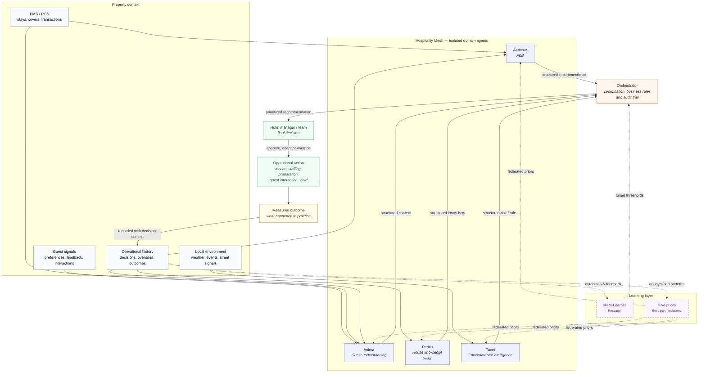

<h1 align="center">The Hospitality Mesh</h1>

  
  
  
  
  
  

  <strong>
    A network of 5 specialized AI agents that learn from every feedback to continually improve decision-making, operations and guest experiences.
  </strong>

  <em>
    The Mesh closes the loop between prediction and outcome: every recommendation is measured against reality, so the system learns what actually works in each hotel.
  </em>

  Each decision is grounded in the property’s own history, guest signals, operational habits, and changing local conditions. Its outcome becomes knowledge for the next one.

  <a href="VISION.md">Vision</a> ·
  <a href="https://ivandemurard.com/aetherix">Case study</a> ·
  Aetherix (private repo — access upon request) ·
  <a href="https://github.com/IvandeMurard/tacet-app">Tacet (public repo)</a> ·
  <a href="https://www.linkedin.com/in/ivandemurard/">Contact</a>

---

## The 5 agents

- **Aetherix** – *Food & Beverage agent*  
  Turns covers, staffing, demand patterns, and outcomes into more reliable F&B decisions from preparation to food-waste reduction.

- **Anima** – *Guest memory agent*  
  Builds a richer understanding of guests across stays, helping teams anticipate needs without reducing hospitality to a generic profile.

- **Peritia** – *House knowledge agent*  
  Captures the house’s savoir-faire so it belongs to the property, not to whoever is on shift.

- **Tacet** – *Environmental intelligence agent*  
  An environmental twin that turns street signals, weather, and local events into structured risk assessments and yield rules.

- **Orchestrator** – *Supervisory agent*  
  Connects the agents, sequences their work, applies business rules, and keeps final operational decisions accountable.

> **Mesh:** a network of microservices that only exchange structured messages.  
> Agents remain strictly isolated for security, reliability, and clear bounded contexts.

---

## The Vision: A Closed Loop, Not a Smarter Model

Rather than generating a static F&B forecast or a daily report, the Mesh closes the loop between what it said and what happened:

- **Measures, like a machine:** Every recommendation is stored next to its real outcome, so the system explicitly knows what it said versus what actually happened — and says so to the manager the next morning, in plain language, including when it was wrong.
- **Understands, like a human:** Contextual reasoning grounded in each property's history, powered by a unified signal ontology that translates chaotic real-world events into structured, cross-domain context.
- **Learns, like a network:** Per-property memory today, federated priors next, leveraging shared intelligence to give independent hotels the power of a hive.

What compounds is the **record of decisions and their outcomes** — including which manager overrode which recommendation, and who turned out to be right.

> **Operational memory, precisely:** persistent agent memory is now commodity infrastructure. The differentiator is the loop: what a human does with each recommendation, what outcome follows, and how the system autonomously learns from it. That takes deployment, not architecture. **This system has zero real users -yet (interested?), so the asset is a mechanism in place, not an accumulated advantage.**

## What this is

This is the public meta‑repo of a multi‑agent system I’ve been building solo since late 2025. It documents the architecture and engineering practices; execution nodes (Aetherix, Tacet, etc.) live in separate repositories.

- **Perception nodes:** domain‑specific agents that expose capabilities as [MCP](https://modelcontextprotocol.io/) tools and never decide.
- **Bespoke Orchestrator:** a central decision engine that holds 100% of the reasoning loop, keeping a human manager as final authority.

## The Mesh Architecture

*Solid lines describe the intended operational loop. Dashed lines mark research-stage learning capabilities; Peritia is designed, not yet implemented.*
### Core Design Principles

1. **Execution nodes never orchestrate.** Perception nodes (Anima, Aetherix, Tacet) interpret signals; the bespoke Orchestrator holds all decision logic.
2. **Glue, not replacement.** The Mesh uses a PMS‑agnostic canonical schema behind adapters. Intelligence is delivered inside existing tools (e.g., 1‑tap WhatsApp receipts), with zero new dashboards.
3. **Preventing HITL fatigue.** The Orchestrator filters noise and sends only high‑significance, composite recommendations. Human approval is a prerequisite, not a differentiator; the hard part is deciding what is worth interrupting a human for.
4. **Continuous Improvement (Meta‑Learner, Research).** A dual loop would optimize decision thresholds via manager feedback and autonomous comparison of predictions vs ground truth. Today, outcome capture exists only inside the F&B node.
5. **Hive Memory (Federated Priors, Research).** A federated layer would share anonymized priors across properties to solve cold‑start, without leaking tenant data. No substrate exists yet.
6. **Accountability wired in.** Every guardrail trip carries a machine‑readable reason; eval gates block merges on exit codes; DPIA gates the guest node; EU AI Act red lines are explicit; metric‑honesty and hygiene agents enforce truthfulness in the repo itself.

## Where this sits in the digital twin landscape

Digital twins are mature in banking, data centres, aerospace. In hospitality, they model buildings and energy — not operational decisions. **The sector models its assets, not its arbitrations.**

| Layer | Models | Here |
|---|---|---|
| Asset | Building, HVAC, energy | Out of scope |
| Process | Prep, staffing, service flows | Aetherix, **Built** |
| Human‑centered | Staff perception, effort, trust | Not a node. See [Lore](https://github.com/IvandeMurard/Lore) |
| Decision | Policies, trade‑offs, scenarios | **Not built** |
| Guest experience | Reaction, friction, loyalty | Signal across the mesh. Anima owns its memory, **Synthetic PoC** |

The decision layer is the interesting one and does not exist here, so none of this is a “decision twin”. Guest experience is not a node; it is a signal that travels across the mesh. [Manzano‑Farray et al. (2026)](https://pmc.ncbi.nlm.nih.gov/articles/PMC13078991/) model the employee to support human judgement, not replace it — the same guard applied here.
## What's built vs. what's vision

This is a solo project — **built by one person, which is a real key‑person (bus‑factor) risk** for anyone relying on it. It is mitigated by tracked decisions (12 ADRs), synchronized recovery harnesses, and deterministic, reproducible pipelines — not by redundancy, and there is no SLA yet. The mesh narrative is a north star; the nodes below are built to de‑risk the architecture, but every status uses one honest label, and **Built means the code runs, not that anyone uses it yet**:

- **Built** — deployed and exercised end‑to‑end on the target environment.
- **Shadow‑mode** — runs on real data, but no decision is delivered to a human on that basis.
- **Synthetic PoC** — validated on fabricated data only; never met the real world.
- **Design** — specified (ADR, schema, contract), not implemented.
- **Research** — open exploration, no delivery commitment.

| Component | Status | Evidence |
|---|---|---|
| **Aetherix** (F&B Node) | **Built** (private, **0 real users**): ~16.5k LOC, staging on Fly.io, 12 ADRs | Case study; walkthrough on request |
| **Aetherix — forecast** | **Shadow‑mode**: benchmarked on real public data; no manager decision delivered on it yet | Recruit benchmark (see Current focus) |
| **Anima** (Guest Node) | **Synthetic PoC**: 4‑layer temporal memory, synthetic cohort eval, working MCP server — never in production (DPIA‑gated) | Local evals & synthetic data |
| **Peritia** (House knowledge agent) | **Design**: adaptation of [Lore](https://github.com/IvandeMurard/Lore) (voice AI mentor for tacit expertise in aviation maintenance) to hospitality; domain & contracts specified, not implemented | ADRs & Lore codebase |
| **Tacet** (Environment Node) | **Built** (public): live data ingestion pipeline | [Public Repo](https://github.com/IvandeMurard/tacet-app) |
| **Bespoke Orchestrator** | **Design**: event‑driven decision engine specified in ADRs; proto‑stub only, not built | Architectural ADRs |
| **Meta‑Learner & Hive priors** | **Research**: no substrate yet (the cohort‑feature table does not exist). Outcome capture exists only inside the F&B node | — |

## Engineering practices I’d bring to a team

I’m building this Mesh solo to master the full lifecycle of agentic AI systems. Beyond wiring API calls, this project demonstrates:

- **Full Ownership & Bespoke Control:** I build critical paths (like the Orchestrator) from scratch to keep logic transparent and deterministic.
- **Evals as merge gates, not dashboards:** golden datasets plus offline CI gates (exit codes block merges), separated from runtime guardrails.
- **A hygiene agent that audits the repo:** automated detectors check harness drift, dead links, undocumented env vars, guardrail coverage, metric honesty, and scheduled job liveness — including on its own claims.
- **Typed failure reasons:** every guardrail trip carries a machine‑readable reason; “it degraded gracefully” is verifiable, not folklore.
- **Continuous discovery as a routine:** weekly PM reviews with explicit watchlists, triggers and pre‑framed mitigations; dead monitors are removed and replaced with observable triggers.
- **Incident response, practiced:** handled a real leaked‑secrets incident end‑to‑end (history rewrite, full credential rotation, GitHub Support purge, post‑mortem).
- **Tests outweigh code:** 1.13:1 test‑to‑app LOC ratio on the main node.

## Current focus (90‑day plan, started July 2026)

1. **Proof:** real‑data forecast benchmark on 30 restaurants from the Kaggle Recruit dataset. Prophet beats a naive same‑weekday baseline on mean MAPE, but ties it on the median; a gradient‑boosted baseline wins the median. Both readings are published. Focus now: closed‑loop demo on the Apaleo sandbox, observability (Logfire traces, LLM cost per recommendation), and F&B manager interviews.
2. **Visibility:** this repo, a technical write‑up on [the blocking eval gate](EVAL_GATE.md), and a demo video.

## Stack

FastAPI • Python (async, Pydantic v2) • Supabase Postgres + pgvector (HNSW) • Prophet • Claude (multi-LLM provider abstraction) • Mistral embeddings • Redis (Upstash) • Twilio WhatsApp • Apaleo PMS (OAuth2) • Fly.io • GitHub Actions (CI + eval gate + schema-drift gate)

## License

MIT, see [LICENSE](LICENSE). The private node repos carry their own terms.
