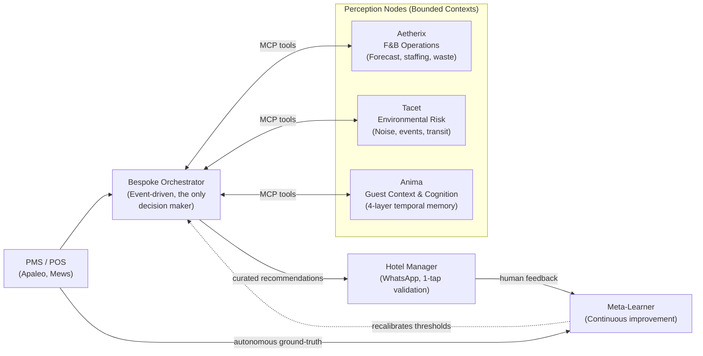

<h1 align="center">Hospitality Agentic Mesh</h1>

  <em>Operational memory for hotel operations: A network of specialized AI agents that anticipate guest needs, evaluate autonomously, and learn from every service to optimize operations and cut costs.</em>

  <a href="https://ivandemurard.com/aetherix">Case study</a> ·
  <a href="https://github.com/IvandeMurard/aetherix-hospitality-ai">Aetherix (access upon request)</a> ·
  <a href="https://github.com/IvandeMurard/tacet-app">Tacet (public repo)</a> ·
  <a href="https://www.linkedin.com/in/ivandemurard/">Contact</a>

---

## The Vision: AI as a Living Operational Memory

This Hospitality Agentic Architecture turns AI into a **living operational memory**. Rather than just generating a static F&B forecast or a daily report, the Mesh acts as a living cognitive system for the property:
- **Understands, like a human:** Contextual reasoning grounded in each property's history, powered by a unified signal ontology that translates chaotic real-world events into structured, cross-domain context.
- **Measures, like a machine:** Every recommendation is stored next to its real outcome, so the system explicitly knows what it said versus what actually happened.
- **Learns, like a network:** Per-property memory today, federated priors next, leveraging shared intelligence to give independent hotels the power of a hive.

The individual forecasts and risk scores are just sensory organs. The true product and value lies in the **per-property memory** as it builds a compounding asset that continually optimizes operations, cuts waste, and elevates the guest experience.

## What this is

This is the public meta-repo of an multi-agent system I've been building solo since late 2025. It serves as the architectural blueprint for an event-driven network of AI agents designed for hotel operations.

At a glance:
- **A Multi-Agent System:** This repo documents the architecture and engineering practices, while the actual execution nodes (like Aetherix) live in separate repositories.
- **Perception Nodes:** Specialized agents that own strict bounded contexts. They expose their capabilities as [MCP](https://modelcontextprotocol.io) tools and focus purely on *understanding* data, never deciding.
- **Bespoke Orchestrator:** A central decision engine built entirely from scratch. It holds 100% of the reasoning loop to separate perception from action, ensuring a human manager is always the final authority.

## The Mesh Architecture

### Core Design Principles

1. **Execution nodes never orchestrate.** The perception nodes (Anima, Aetherix, Tacet) strictly *interpret* signals within their domain. They never decide when to run or what action to take. The bespoke Orchestrator holds 100% of the decision logic.
2. **Glue, not replacement Delivery.** The Mesh operates via a PMS-agnostic canonical schema behind adapters. Intelligence is delivered directly inside the tools managers already use (e.g., 1-tap WhatsApp "receipts" summarizing the reasoning), requiring zero new dashboards to monitor.
3. **Preventing HITL (Human-in-the-Loop) Fatigue.** Human-in-the-loop is structural, but a manager bombarded with alerts will ignore them. The Orchestrator uses calibrated thresholds to filter out the noise, sending only high-significance, composite recommendations.
4. **Continuous Improvement (The Meta-Learner).** The system *would* use a dual learning strategy to optimize the Orchestrator's decision thresholds — this loop is **Research**, not yet built:
    - *Human Feedback Loop:* every manager 1-tap response (accept/reject) would train the system.
    - *Autonomous Loop:* the system would compare its past predictions against ground-truth flowing from the PMS/POS, self-correcting without human intervention.
   Today, outcome capture exists only inside the F&B node; the federated meta-learner does not.
5. **Hive Memory (Federated Priors).** To solve cold-start for new hotels, a federated "Hive" layer *would* share anonymized, learned priors across properties for day-1 effectiveness without leaking tenant data. This layer is **Research**: there is no substrate today (the cohort-feature table does not yet exist), so no prior is shared.

## The Nodes

### Anima: The Relational Core (Guest Context)
Hospitality is fundamentally about the guest. Anima is the intelligence engine that allows the hotel to anticipate and personalize the experience as if every guest were a regular. It utilizes a **4-layer temporal memory** (Working, Episodic, Semantic, Segment) to prevent "over-fetching" context, ensuring the Orchestrator makes the *right gesture* for the *right guest* at the *right time*.

### Aetherix: F&B Execution
Aetherix anticipates staffing and F&B needs to cut food waste and control costs. It ingests historical data, weather, and local events to forecast operational pressure, issuing daily recommendations for kitchen prep and front-of-house staffing.

### Tacet: Environmental Awareness
Tacet listens to the city. It monitors external risks—construction noise, transit strikes, and local events—translating chaotic real-world data into structured risk scores so the hotel can act proactively.

## What's built vs. what's vision

This is a solo project — **built by one person, which is a real key-person (bus-factor) risk** for anyone relying on it. It is mitigated by tracked decisions (12 ADRs), synchronized recovery harnesses, and deterministic, reproducible pipelines — not by redundancy, and there is no SLA yet. The mesh narrative is a north star; the nodes below are built to de-risk the architecture, but every status uses one honest label, and **Built means the code runs, not that anyone uses it yet**:

- **Built** — deployed and exercised end-to-end on the target environment.
- **Shadow-mode** — runs on real data, but no decision is delivered to a human on that basis.
- **Synthetic PoC** — validated on fabricated data only; never met the real world.
- **Design** — specified (ADR, schema, contract), not implemented.
- **Research** — open exploration, no delivery commitment.

| Component | Status | Evidence |
|---|---|---|
| **Aetherix** (F&B Node) | **Built** (private, **0 real users**): ~16.5k LOC, staging on Fly.io, 12 ADRs | Case study; walkthrough on request |
| **Aetherix — forecast** | **Shadow-mode**: benchmarked on real public data; no manager decision delivered on it yet | Recruit benchmark (see *Current focus*) |
| **Anima** (Guest Node) | **Synthetic PoC**: 4-layer temporal memory, synthetic cohort eval, working MCP server — never in production (DPIA-gated) | Local evals & synthetic data |
| **Tacet** (Environment Node) | **Built** (public): live data ingestion pipeline | [Public Repo](https://github.com/IvandeMurard/tacet-app) |
| **Bespoke Orchestrator** | **Design**: event-driven decision engine specified in ADRs; proto-stub only, not built | Architectural ADRs |
| **Meta-Learner & Hive priors** | **Research**: no substrate yet (the cohort-feature table does not exist). Outcome capture exists only inside the F&B node | — |

## Engineering practices I'd bring to a team

I am building this Mesh solo from zero-to-one to master the full lifecycle of agentic AI systems. Beyond just stringing API calls together, this project demonstrates the structured engineering practices I'd bring to any full-time engineering role:

- **Full Ownership & Bespoke Control:** I build the critical path (like the Orchestrator) from scratch. When off-the-shelf frameworks obscure reasoning or limit control, I engineer bespoke solutions that keep the logic 100% transparent and deterministic.
- **Evals as merge gates, not dashboards.** Golden dataset plus an offline gate in CI (exit codes block the merge), separated by contract from runtime guardrails.
- **A hygiene agent that audits the repo, including its own claims.** Ten detectors run weekly and on every pull request, comparing what the repo *says* to what it *is*: harness drift, docs citing files that do not exist, undocumented env vars, guardrail reasons no eval scenario covers, self-declared line ceilings, hardcoded counts, unqualified metrics, properties asserted without anything that could falsify them, branches pushed with no pull request, and whether the weekly job itself still runs.

  It earns its keep. It caught this repository claiming the forecast benchmark ran on 829 restaurants when it ran on 30, the dataset size passed off as the sample, on six surfaces at once, including the sentence arguing for honest reporting. The published results file had said 30 throughout. Two of those six were found by the detector after a manual pass had missed them. The fix and the check that prevents the recurrence shipped together.

- **Typed failure reasons.** Every guardrail trip carries a machine-readable reason; "it degraded gracefully" is verifiable, not folklore.
- **Continuous discovery as a routine, not an event.** Every Monday morning: an automated scan of the market and competitive watchlist (PMS vendors, agentic startups, MCP ecosystem moves), followed by a proactive PM review session run with agent workflows. Findings feed a watchlist re-evaluated at each phase gate.
- **Incident response, practiced.** Handled a real leaked-secrets incident end-to-end: history rewrite, 11/11 credential rotation, GitHub Support purge, and post-mortem.
- **Tests outweigh code.** 1.13:1 test-to-app LOC ratio on the main node.

## Current focus (90-day plan, started July 2026)

1. **Proof:** real-data forecast benchmark — *on 30 real restaurants drawn from the Kaggle Recruit dataset (829 in total), Prophet beats a naive same-weekday baseline by 6.15 pts of mean MAPE, but **ties it on the median day** (MdAPE 27.0% vs 27.6%) and is marginally worse at J+1; a gradient-boosted baseline wins the median (25.6%). Both readings are published because the flattering one alone would not be true, and the forecast is not led as the differentiator until it clears a pre-registered bar on real hotel data (shadow mode).* • closed-loop demo on the Apaleo sandbox (forecast, recommendation, feedback, recalibration) • observability (Logfire traces, LLM cost per recommendation) • F&B manager interviews.
2. **Visibility:** this repo • a technical write-up on the blocking eval gate ([published](https://ivandemurard.com/journal/harnesses-graders-closed-loops) — the vocabulary, the severity tiers, the exit-code contract, and the canary that got invalidated) • a demo video.

## Stack

FastAPI • Python (async, Pydantic v2) • Supabase Postgres + pgvector (HNSW) • Prophet • Claude (multi-LLM provider abstraction) • Mistral embeddings • Redis (Upstash) • Twilio WhatsApp • Apaleo PMS (OAuth2) • Fly.io • GitHub Actions (CI + eval gate + schema-drift gate)

## License

MIT, see [LICENSE](LICENSE). The private node repos carry their own terms.
