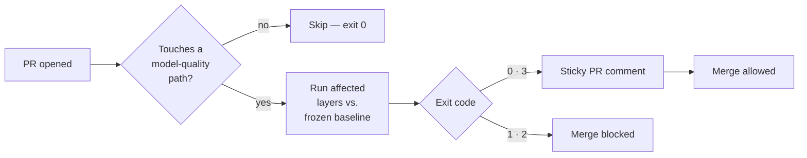

# Blocking CI on ML: Making Prophet Deterministic in GitHub Actions

  
  
  

> CI green tells you the code runs. It says nothing about whether the model still predicts well.

That gap is how a forecasting model quietly gets worse, one merged PR at a time, until a manager
notices the recommendations stopped making sense. Nobody wrote a failing test — nothing failed.

This is the story of the gate we built to close that gap, and the three CI runs it took to prove
a statistical model could be trusted enough to block a merge on.

## The problem with "tests pass"

A blocking CI check on **code correctness** is table stakes. A blocking CI check on **model
quality** is rare, and for a good reason: most model outputs are numbers, not booleans. There's
no natural "assert" for "the forecast got worse."

So teams either skip it, or run evals as a dashboard nobody reads until something breaks. Neither
stops a bad PR from merging.

## What the gate actually does

Every PR that touches forecasting, parsing, recommendation, or memory code gets diffed against a
golden dataset of scenarios — normal days, event spikes, weather anomalies, out-of-distribution
edge cases. The result gets compared to a frozen baseline. A real regression blocks the merge.

`[screenshot: the sticky PR comment rendering the eval report — per-category MAPE delta, parser
accuracy delta, drift status]`

## Four outcomes, not two

| Exit code | Meaning | Blocks merge? |
|:---:|---|:---:|
| **0** | Pass, or nothing touched, or a cache hit | No |
| **1** | Real regression — over 3pp on any category, or coverage under 60% | **Yes** |
| **2** | Script crashed, or the dataset is corrupt | **Yes** |
| **3** | Warn — coverage between 60-80%, surfaced but not blocking | No |

A PR can also opt out with an `eval-exempt` label — but only for five audited reasons (pure
refactor, docs-only, infra-only, CI-only, tests-only). Everything else needs a scenario or a
regression check. No silent exceptions.

## The problem: Prophet is stochastic

Here's the catch. The forecast model — Prophet — doesn't always converge to the exact same fit.
Ship this gate as blocking before proving that noise out, and it fails PRs for no reason. A
noisy gate gets disabled by the second false alarm, and then you have no gate at all.

So it shipped **non-blocking first.** Advisory only, for weeks, while we looked for proof.

## The canary that proved it

We needed three consecutive CI runs of the same forecast, on the same code, to see whether the
"stochastic" model was actually just drifting library versions between local and CI.

> **3 runs. Identical MAPE: 25.40%. Zero regressions. 0.00 percentage points of variance.**

The instability wasn't Prophet. It was environment drift — CI's library versions weren't pinned
to local. Fit in MAP mode with `L-BFGS`, on a frozen environment, Prophet is deterministic.
Freeze the baseline from a CI run instead of a laptop, and the noise disappears.

`[screenshot: the GitHub Actions run log showing the 3 canary runs back to back, identical MAPE]`

That was the evidence bar. Once cleared, one line changed: `EVAL_GATE_BLOCKING="true"`. The gate
now only ever blocks on a real regression — never on reproducibility noise.

## What it still doesn't cover

Worth saying plainly, because a gate is only as trustworthy as its stated limits:

- **Reasoning quality** — whether an explanation is *factually correct* — isn't automated yet.
  It ships only once the judge itself is calibrated against human verdicts, so it doesn't get to
  grade before it's shown it grades like a person would.
- **Memory recall** runs as a smoke check today, not full annotated-ground-truth precision.
- **Outcome-level evaluation** — did accepting the recommendation actually help — lives outside
  this gate entirely. That's a downstream measurement, not a pre-merge check.

The honest claim this gate makes is narrower than "the AI is good." It's: *this PR didn't make
the model worse on the cases we've told it to check.* Smaller, checkable, and actually enforced.

## Go deeper

This is the short version. The full mechanics — trigger-path detection, the golden-dataset
taxonomy, coverage math, the offline-vs-runtime split that decides what even needs a scenario —
are in [`EVAL_GATE.md`](../EVAL_GATE.md). The rest of the system this gate protects is in the
[meta-repo README](../README.md).
